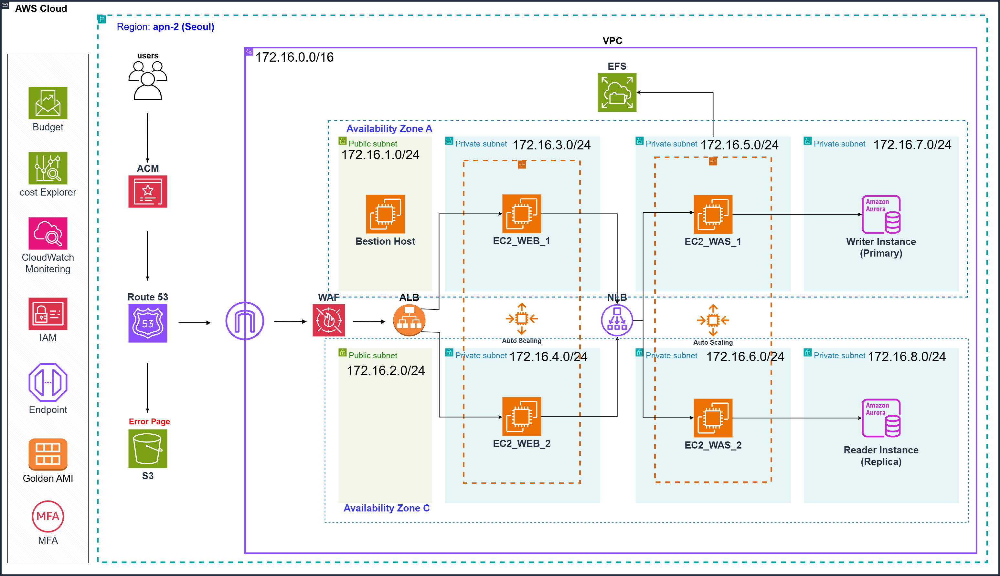

중대형 동물병원을 위한 고가용성 예약 시스템 마이그레이션 프로젝트
# 📌 프로젝트 개요
성장하는 중대형 동물병원의 온프레미스 운영 한계를 극복하기 위해, AWS 클라우드로의 마이그레이션 및 현대적 3-Tier 아키텍처 재설계를 수행했습니다. 24/7 무중단 서비스와 데이터 무결성을 최우선으로 하며, 예방접종 시즌 등 급격한 트래픽 증가에도 탄력적으로 대응할 수 있는 인프라를 구축하는 것이 목표입니다.

# 🏗 아키텍처 설계 (Architecture)

Key Architectural Decisions
Network Isolation (Enterprise Standard): 모든 서비스 서버(Web/WAS/DB)를 Private Subnet에 배치하여 외부 직접 노출을 차단하고, 가용 영역(Multi-AZ) 분산 배치를 통해 단일 장애 지점(SPOF)을 제거했습니다.
Bestion Host: 이슈 발생 및 관리자 접속 시 베스천 호스트를 두어 관리하고 평소에는 사용하지 않도록 인스턴스를 중지합니다.

Dual Load Balancing (Performance Optimization):

External ALB: 유저의 접근 정보 확인 및 HTTP/HTTPS 프로토콜 처리를 위한 L7 로드밸런싱 수행.

Internal NLB: ALB에서 검증된 패킷을 내부 WAS(Tomcat/TCP)로 초저지연 전달. 불필요한 패킷 분석 오버헤드를 줄여 성능을 극대화했습니다.

Aurora DB Cluster: MySQL 대비 비약적으로 빠른 장애 복구와 Reader Endpoint를 통한 읽기 트래픽 분산으로 동시 예약 조회 성능을 확보했습니다.

# 🛠 단계별 구축 과정 (Implementation Steps)
STEP 1. 서비스 기획 및 네트워크 설계
  VPC CIDR: 172.16.0.0/16 (엔터프라이즈급 확장성을 고려한 Class B 설계)

  Subnet 전략:

  Public: ALB, NAT Gateway, Bastion Host (관리 및 외부 접점)

  Private: Web, WAS, DB 계층 분리 및 Multi-AZ 구성

STEP 2. 골든 이미지(Golden Image) 및 서버 설계
  환경 구성: Java, Tomcat, MariaDB105, CloudWatch Agent

  재사용성 확보: stress-ng, nc 등 테스트 도구와 EFS 마운트 설정을 포함한 AMI를 생성하여 Auto Scaling 시 즉각적인 서비스 투입이 가능하도록 구성했습니다.

STEP 3. 로드밸런서 및 데이터베이스 구축
  ALB: L7 계층의 세밀한 트래픽 제어 및 보안 정책 적용.

  NLB: 교차 영역 로드 밸런싱(Cross-Zone Load Balancing) 활성화로 WAS 가용성 극대화.

  Aurora DB: Writer/Reader 역할 분리로 대규모 조회 트래픽(진료 예약 정보 등) 대응.

STEP 4. Auto Scaling 및 모니터링 정책
Scaling Policy (Data-Driven): * 부하 테스트 시 **1500 TPS에서 CPU 점유율이 70%**를 상회하는 것을 확인.

  **Scale-out 65% / Scale-in 20%**로 설정하여 선제적 대응 체계 구축.

  Scaling Uptime: 신규 인스턴스의 워밍업 시간을 고려한 총 5분 설정.

🚨 보안 및 관리 전략
Identity Management: IAM 사용자를 3개 카테고리로 분리(Admin, Infra, DB)하여 권한 최소화 원칙 준수.

Resource Tagging: Owner, Team, Service 태그를 통한 리소스 책임 소재 명확화 및 비용 추적 최적화.

Cost Management: Cost Explorer 상시 모니터링 및 테스트 단계의 DB I/O 최적화 인스턴스 선택으로 비용 효율성 달성.

Budget Alram: 병원 시스템의 일,주간 비용 측정하여 월 예산에 대한 알람 구성

📊 프로젝트 성과 및 배운 점
무중단 가용성 검증: 특정 가용 영역 장애 상황 가상 시나리오에서 자동 장애 복구 및 서비스 연속성 확인.

성능 최적화: ALB-NLB 이중 구조를 통한 내부 통신 지연 시간 최소화 경험.

확장성 확보: 트래픽 가변성에 따른 인프라의 탄력적 운영 메커니즘 이해.

🔗 상세 구축 로그 및 트러블슈팅: https://giddy-dryer-b71.notion.site/2f7fb70584938063a190d19d9005b0a7?pvs=74
